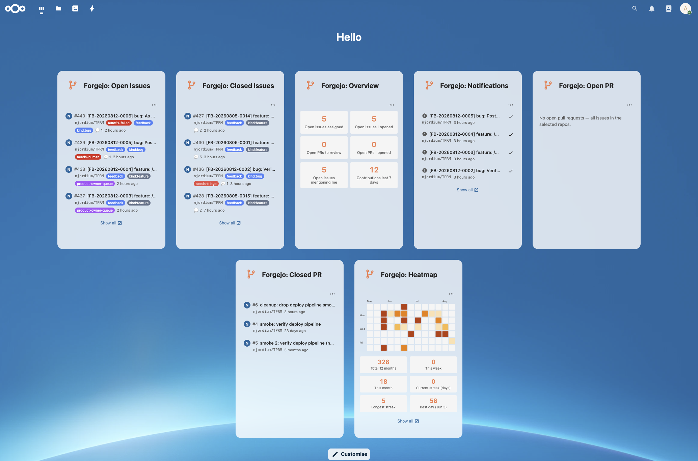

# Forgejo / Gitea integration for Nextcloud

[](https://github.com/njordium/integration_forgejo_gitea/actions/workflows/lint.yml)
[](https://github.com/njordium/integration_forgejo_gitea/releases)
[](COPYING)



> Njordium-authored Nextcloud integration for [Forgejo](https://forgejo.org/) and [Gitea](https://gitea.io/) instances. Nextcloud **30 to 34**, PHP **8.1+**, Vue 3 / `@nextcloud/vue` v9, OAuth 2.0 authorization-code flow, eleven configurable dashboard widgets, per-widget repository picker and refresh-frequency, brand-aware icons and titles that switch between Forgejo and Gitea based on your instance type.

Bring the parts of Forgejo / Gitea that people actually check ten times a day into the Nextcloud dashboard. Assigned issues and pull requests, pending reviews, notifications, recent commits, milestone progress, repository state, an at-a-glance KPI overview, and a GitHub-style contribution heatmap. All configurable per user, per widget.

The app is instance-agnostic: point it at a self-hosted Forgejo or Gitea (both use the compatible `/api/v1/` surface), the widget titles, icons and links adapt to the configured instance type.

---

## Features

### Dashboard widgets

Eleven widgets, grouped by intent. Enable any subset via **Customise** on the Nextcloud dashboard.

**Overview** — one-glance summary

- **Overview**. Six KPI tiles in a compact 2×3 grid: open issues assigned, open issues you opened, open PRs where your review is requested, open PRs you opened, open issues mentioning you, and contributions in the last 7 days. Each tile is clickable and lands on the equivalent Forgejo dashboard filter.

**Work queue** — what needs your attention

- **Open Issues**. Latest open issues from the repositories you pick, filtered by *assigned to me / created by me / mentioning me / all issues in the selected repos*. Row shows number, title, assignee avatar, up to three colour-matched label chips, repo full-name, comment count and relative timestamp.
- **Closed Issues**. Same widget parametrised for closed state — useful for review passes and post-mortems.
- **Open Pull Requests**. Same UX as issues, filtered to pull requests. The "assigned to me" filter maps to "reviewer / assignee" in Forgejo terms.
- **Closed Pull Requests**. Merged and closed PRs across your selected repos.
- **Pending reviews**. Open PRs where you are specifically a requested reviewer, across your selected repos. Narrower than "Open PRs → assigned to me" — this is the review queue.
- **Notifications**. Unread Forgejo/Gitea notifications with type icons (issue / PR / commit / repository). Per-row **Mark as read** button that PATCHes `/notifications/threads/{id}` and removes the row live.

**Activity** — what happened

- **Recent commits**. Latest commits across your selected repos. Optional "only commits authored by me" switch in the widget settings. Row shows short SHA, first line of commit message, author avatar, repo full-name and relative timestamp.
- **Activity heatmap**. Last 3 or 6 months of contribution activity rendered as a GitHub-style calendar heatmap, colour-scaled by daily count. Below the heatmap: a 2×3 stats grid (total 12 months, this week, this month, current streak, longest streak, best day). Cell size adapts to the selected window so the graph stays legible in the dashboard card. "Show all" link points at your Forgejo profile's Public-activity tab where the full 12-month heatmap lives.

**Repositories** — project state

- **Milestones**. Open milestones across your selected repos with a per-milestone progress bar (`closed / total` issues), due date, and repo full-name. Sorted by due date so what's overdue or imminent surfaces first.
- **Repository stats**. Per-repo card list showing stars, forks, open issues, open PRs, latest release tag, and last-updated date. Compact enough to fit multiple repos vertically.

Every widget carries a `⋯` menu top-right with **Widget settings** and **Refresh** actions. Widget settings opens a modal with a per-widget **Refresh frequency** picker (Never / 30s / 1m / **5m default** / 15m / 30m / 1h) and, for widgets that fetch repo-scoped data, a searchable multi-select **Repositories** picker plus filter radio. Settings persist per user, per widget — configure two widgets for two different repo sets without collision.

Every widget polls in the background at the user-selected cadence, pauses while the browser tab is hidden, and re-fetches once the tab regains focus. The default 5-minute cadence gives you fresh data without hammering Forgejo.

### Auto-refresh + tab-hidden pause

All eleven widgets use a shared `useAutoRefresh` composable that sets a `setInterval` at the user-configured cadence, pauses when `document.visibilityState !== 'visible'`, and re-fetches once on visibility change. An idle dashboard tab left open in a background tab does not hammer Forgejo.

### Brand-aware UX

The admin picks the instance type (Forgejo or Gitea). Every widget's icon and title switch to match: **Forgejo** orange horn logo (CC-BY-SA-4.0, Caesar Schinas) with titles like *Forgejo: Open Issues*; **Gitea** green tea-cup logo with titles like *Gitea: Open Issues*. Two Njordium teams running different forges get UIs that visually reflect their platform.

### Security

- **OAuth 2.0 authorization-code flow** (RFC 6749) is the only connect path. No password grant, no plaintext credential capture.
- **CSRF-protected state parameter** — 32 bytes of `random_bytes()` bound to the user's Nextcloud session, verified with `hash_equals()` on the callback. See [`SECURITY.md`](SECURITY.md) for the full OAuth threat-model discussion.
- **Access + refresh tokens encrypted at rest** via Nextcloud's `ICrypto` (AES-256-CBC with the per-instance secret). Decryption failures return empty and force reconnect, never surface as errors.
- **Sensitive data redacted from logs** — earlier releases inadvertently wrote Bearer tokens into `nextcloud.log` via Guzzle's exception context; the current release logs a structured summary with tokens and secrets replaced by `[REDACTED]`. See the A09 finding in [`SECURITY.md`](SECURITY.md).
- **Instance URL validated** on admin write — non-`http(s)` schemes rejected outright, plain HTTP against non-loopback hosts flagged with a warning (loopback dev setups still allowed silently).
- **Generic error responses to the browser** — upstream detail (which could leak internal endpoint paths) stays in the server log; the client sees short codes like `upstream_500` / `request_failed`.

Full OWASP Top 10 mapping and follow-up hardening items are in [`SECURITY.md`](SECURITY.md).

---

## Requirements

- Nextcloud **30 – 34**
- **Forgejo** or **Gitea** (any recent version — both expose the same `/api/v1/` surface, both support OAuth authorization-code grant)
- PHP **8.1+** (CI verifies syntax and PHPUnit on 8.1 / 8.2 / 8.3; PHPStan runs at level 5 against `nextcloud/ocp:dev-stable30`)
- Node **20+** and npm **10+** for building from source

---

## Installation

### From a release zip (recommended for production)

Download the release tarball from the [Releases page](https://github.com/njordium/integration_forgejo_gitea/releases). Extract into your Nextcloud `custom_apps/` directory (**not** the bundled `apps/` directory), fix ownership, then enable via **Apps → Integration → Forgejo / Gitea integration**.

### Manual install (source)

```bash
cd /var/www/nextcloud/custom_apps
git clone https://github.com/njordium/integration_forgejo_gitea.git
cd integration_forgejo_gitea
chown -R www-data:www-data .
```

Then enable in **Apps → Integration → Forgejo / Gitea integration**.

The compiled `js/` bundles are tracked in the repository so a `git pull` on the host is enough to deploy new versions — no `npm ci && npm run build` step required. Every tagged release (e.g. [v1.0.2](https://github.com/njordium/integration_forgejo_gitea/releases/tag/v1.0.2)) also ships a release tarball for the Nextcloud App Store install path.

### From the Nextcloud App Store

Once submitted: search for "Forgejo / Gitea integration" in **Apps → Integration**. Not yet published.

---

## Configuration

### Admin

1. On your Forgejo/Gitea instance, open **Site Administration → Applications → Create Application**.
2. Set **Redirect URI** to `https://<your-nextcloud>/apps/integration_forgejo_gitea/oauth-redirect`. This has to match byte-for-byte what the admin panel in Nextcloud will show you — copy from that panel's **Copy** button rather than typing.
3. Save. Forgejo/Gitea returns the **Client ID** and **Client Secret**.
4. In Nextcloud, open **Settings → Administration → Connected accounts → Forgejo / Gitea integration**.
5. Fill in:
   - **Instance type** — Forgejo or Gitea. Drives the widget titles and icons.
   - **Instance address** — e.g. `https://git.example.org`. Must have a scheme (`http` or `https`); non-loopback HTTP raises a warning.
   - **OAuth client ID** and **OAuth client secret** from step 3.
6. Save (auto-saves ~2 seconds after the last keystroke). The **Redirect URI** shown at the bottom of the form is the value to register in Forgejo/Gitea — click **Copy**.

### If Forgejo/Gitea is on your LAN or same host as Nextcloud

Nextcloud's HTTP client refuses outbound requests to RFC-1918 addresses (10/8, 172.16/12, 192.168/16) and loopback by default, as an SSRF guard. If your Forgejo/Gitea URL is on any of those ranges, OAuth exchange fails with:

```
Host "<address>" violates local access rules
```

Whitelist local outbound targets:

```bash
sudo -u www-data php occ config:system:set allow_local_remote_servers --value=true --type=boolean
```

Applies to Docker-on-same-host setups, Proxmox LXC deployments where Nextcloud and Forgejo are separate containers on the PVE bridge, and any cloud VPC where both apps are on internal-only IPs.

### Per user

1. Open **Settings → Personal → Connected accounts → Forgejo / Gitea integration**.
2. Click **Connect to Forgejo** (or **Connect to Gitea**). You will be redirected to your instance to sign in and approve access. On approval you land back in Personal Settings connected.
3. Optional: fill in **Query as a different username** if your Forgejo/Gitea login differs from the identity you want the widgets to filter by (bot accounts, shared team accounts, SSO logins whose sub differs from the Forgejo username). Empty means "use my OAuth login" — the previous behaviour.
4. Add widgets to your dashboard via **Customise**, then click each widget's `⋯` menu to open **Widget settings** and pick the repositories, filter and refresh frequency you want.

### Connect flow

Standard OAuth 2.0 authorization code:

1. Click **Connect** — Nextcloud generates a 256-bit `state`, stores it in your session, and redirects your browser to `<instance>/login/oauth/authorize?client_id=…&response_type=code&state=…&redirect_uri=…`.
2. Sign in and approve on Forgejo/Gitea.
3. Forgejo/Gitea redirects back to `/apps/integration_forgejo_gitea/oauth-redirect?code=…&state=…`.
4. Nextcloud verifies `state` with `hash_equals()`, POSTs to `/login/oauth/access_token` for the access/refresh token pair, calls `/api/v1/user` to resolve your login, encrypts the tokens with `ICrypto`, and lands you back in Personal Settings with a success flash.

Your Forgejo/Gitea password is never sent to Nextcloud.

Access tokens are refreshed transparently — the API service catches HTTP 401 responses, exchanges the refresh token for a fresh access token, retries the original call once, and only bubbles the failure to the widget if the refresh itself fails.

---

## Deployment scenarios

### Local Docker (dev / test)

Both Nextcloud and Forgejo in containers on the same host. Works out of the box **once you set `allow_local_remote_servers=true`** (the docker bridge is RFC-1918). Redirect URI in the Forgejo OAuth application must match the URL your browser uses to reach Nextcloud (typically `http://<host-ip>:<port>`), not the container's internal DNS name.

Docker Compose reference used in the current test setup (Nextcloud 30 apache + MariaDB) is in this repository's development notes. The app lives under `data/nc/custom_apps/integration_forgejo_gitea/` inside the bind-mounted Nextcloud volume, so a host-side `git pull && chown -R 33:33 .` + `docker compose restart nextcloud` deploys a new version in ~15 seconds.

### Behind a reverse proxy (nginx, Apache, Cloudflare Tunnel)

Any TLS-terminating proxy in front of Nextcloud works, as long as the standard `overwriteprotocol` / `overwritehost` / `trusted_proxies` triple is set in `config/config.php` so Nextcloud produces external URLs correctly. The **Redirect URI** the admin panel generates comes from `IURLGenerator::linkToRouteAbsolute` — get the overwrite trio right and the redirect URI matches what your browser sends when Forgejo bounces you back.

### Proxmox LXC / bare-metal

Nextcloud in one LXC, Forgejo in another, PVE-host reverse proxy in front of both — works. Whitelist `allow_local_remote_servers` if the two LXCs sit on a private bridge with 10/172/192 addresses.

### Cloud (AWS VPC, Azure VNet, GCP VPC)

If both Nextcloud and Forgejo are cloud-internal (VPC-private IPs), enable `allow_local_remote_servers`. If Forgejo is public-facing (real DNS reachable from the internet), no local-access change is needed. Preserve the `secret` value in Nextcloud's `config.php` across restores — stored OAuth tokens are encrypted with it, and a mismatch invalidates every user's connection.

---

## Troubleshooting

Keyed by symptom.

### "Failed to load items" on Issues / PR widgets

Usually one of three things:

1. **Not connected.** Widget shows "Connect your account in Personal Settings first." — click through to Personal Settings and connect.
2. **Expired token, refresh failed.** Rare, but if your Forgejo revoked the client, or the refresh token expired (Forgejo's default lifetime is long), reconnect from Personal Settings.
3. **Real request error.** Response body carries a short code (`request_failed`, `upstream_500`, `not_connected`). Detail is in `nextcloud.log` under the `integration_forgejo_gitea` context.

### `jsresourceloader` warnings after upgrade

`Could not find resource integration_forgejo_gitea/js/…` warnings after upgrading usually mean PHP OpCache is holding stale widget-class bytecode that still calls old bundle names. Restart the container / PHP-FPM process to invalidate. In Docker:

```bash
docker compose restart nextcloud
```

### Widget icon still shows the placeholder F after a logo swap

Nextcloud tags asset URLs with the app version. Bump `<version>` in `appinfo/info.xml` (or run `occ upgrade` after replacing the SVG), then hard-refresh the browser. Direct-URL access to the SVG under `/apps/integration_forgejo_gitea/img/*` returns 404 by design — Nextcloud does not expose app static files as public routes; the widget CSS loads them from within the app context, which works.

### Widget shows "No repositories accessible with the current token"

The OAuth application scope excluded `read:repository` and/or `read:user`. Delete the OAuth application in Forgejo, recreate it with those scopes selected, update the client ID / secret in Nextcloud admin, and reconnect from Personal Settings.

### The Overview "Open issues I opened" count seems off

`/repos/issues/search` takes **boolean** filters (`assigned=true`, `created=true`, `mentioned=true`, `review_requested=true`) relative to the bearer-authenticated user. Earlier releases passed the wrong parameter names and the endpoint silently returned all visible issues; the current release uses the correct booleans. Bearer identity, so if you have a **Query as a different username** override set in Personal Settings, note that the Overview tile counts still respect the OAuth-connected identity — the override applies to per-repo queries (Issues, PRs, Commits, Milestones, Reviews) and the heatmap only. Documented as a known trade-off.

---

## Development

```bash
# JS/Vue
npm ci
npm run watch          # dev build with file watching
npm run lint
npm run stylelint
npm run build          # production build

# PHP
composer install
vendor/bin/phpunit --configuration phpunit.xml
vendor/bin/phpstan analyse --configuration phpstan.neon --no-progress
```

The `nextcloud/ocp:dev-stable30` dev dependency provides OCP interface stubs that PHPStan scans via `scanDirectories: vendor/nextcloud/ocp/OCP` in `phpstan.neon`. Pinning to `dev-stable30` (rather than `dev-master`) keeps the app aligned with our minimum supported Nextcloud version (30) and its PHP 8.1 baseline — running against `dev-master` would drag in PHP 8.3+ requirements that don't reflect what the app actually targets.

The dashboard bundle is a single `dashboard.js` that registers all eleven widget IDs via `OCA.Dashboard.register`. The build produces four bundles total: `dashboard`, `personalSettings`, `adminSettings`, plus the `@nextcloud/*` vendored chunks. Each PHP widget's `load()` method calls `Util::addScript(APP_ID, APP_ID.'-dashboard')` so the shared bundle is loaded once regardless of how many widgets the user has enabled.

---

## Contributing

Issues and pull requests welcome at [njordium/integration_forgejo_gitea](https://github.com/njordium/integration_forgejo_gitea/issues).

---

## Third-party assets

- `img/forgejo.svg` — Forgejo logo, © the Forgejo project (Caesar Schinas), licensed **CC-BY-SA-4.0**. Source: [Wikimedia Commons](https://commons.wikimedia.org/wiki/File:Forgejo_logo.svg).
- `img/gitea.svg` — Gitea logo, © the Gitea project, licensed **CC-BY-4.0**. Source: [Gitea GitHub repository](https://github.com/go-gitea/gitea).

## License

AGPL-3.0-or-later. See [COPYING](COPYING).
